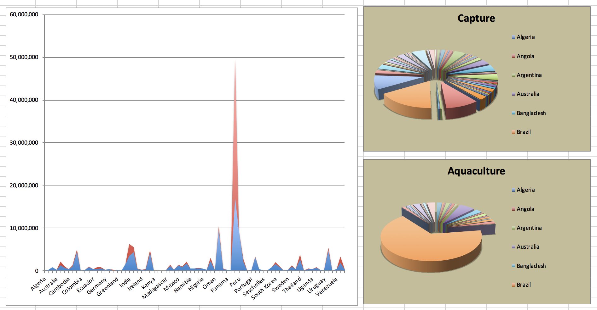
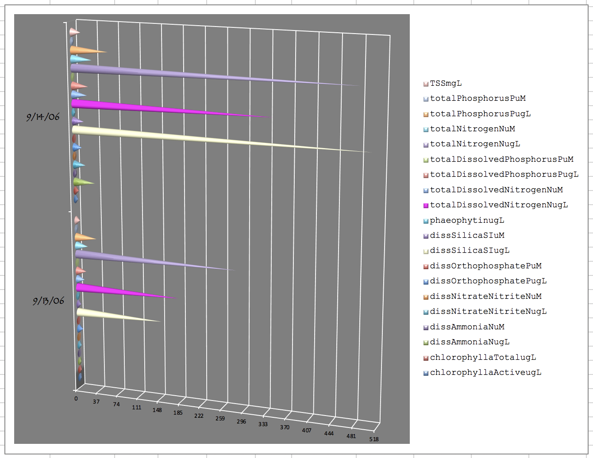

### Improve the data visualization assigned to you in class. Remove the images for the ones not assigned to you.

- team-gg - Fisheries
- no-name - Staff employment trends
- the-models - Nutrition
- geom_points - Staff employment trends


1. Fishing industry by country

```{r echo=FALSE}

```

2. InstructionalStaffEmployTrends

```{r echo=FALSE}

```

3. NERRS Nutrient Data

```{r echo=FALSE}
knitr::include_graphics("img/staff-employment.png")
```


### Create a 5 min presentation about how you improved the presentation. Your presentation can be created using any software.

