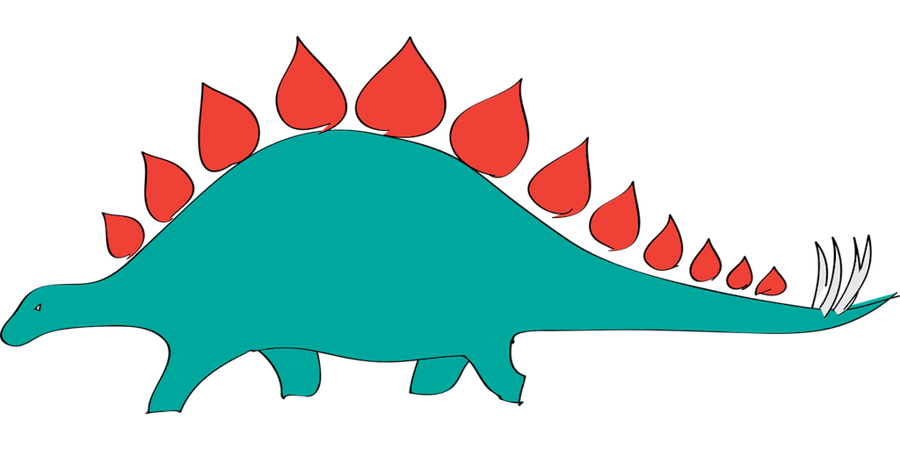

<div style= "float:right;position: relative; margin-left: 20px">
```{r setup, echo=FALSE, fig.align="right", out.width=500}

```
</div>

```{r include=FALSE}
library(tidyverse)
library(datasauRus)
options(
  htmltools.dir.version = FALSE, # for blogdown
  show.signif.stars = FALSE     # for regression output
  )
```

# Introduction

```{marginfigure}
R is the name of the programming language itself and RStudio is a convenient interface.
```

The main goal of this assignment is to introduce you to R and RStudio, which we will be using throughout the course both to learn the statistical concepts discussed in the course and to analyze real data and come to informed conclusions. 

As the course progresses, you are encouraged to explore beyond what the assignments dictate; a willingness to experiment will make you a much better data scientist. Before we get to that stage, however, you need to build some basic fluency in R. Today we begin with the fundamental building blocks of R and RStudio: the interface, reading in data, and basic commands.

# Getting started

Go to [RStudio Cloud](https://rstudio.cloud/spaces/3518/projects) and make a copy of the project for this assignment: **hw-02-dinosaur**.

# Packages

In this lab we will work with two packages: `datasauRus` which contains the dataset, and `tidyverse` which is a collection of packages for doing data analysis in a "tidy" way.

These packages have already been loaded for you, hence you should be able to Knit your R Markdown (Rmd) document and see the results.

If you'd like to run your code in the Console as well you'll also need to load the packages there. To do so, run the following in the console. 

```{r eval = FALSE}
library(tidyverse) 
library(datasauRus)
```

Note that the packages are also loaded with the same commands in your R Markdown document.

# Warm up:

```{marginfigure}
YAML stands for **Y**AML **A**in't **M**arkup **L**anguage. You can read more about it [here](https://en.wikipedia.org/wiki/YAML), but all you really need to know about it is that it is where you store header information (e.g. `title`, `date`, `author`) as well as certain preferences for the document (e.g. `output: html_document`).
```

The top section of the R Markdown document contains some metadata about the document. This section is called the YAML. When you knit the document, this information gets rendered into a nicely formatted header.

```{r yaml-raw-to-rendered, fig.fullwidth=TRUE, echo = FALSE}
knitr::include_graphics("img/yaml-raw-to-rendered.png")
```

# Data

```{marginfigure}
If it's confusing that the data frame is called `datasaurus_dozen` when it contains 13 datasets, you're not alone! Have you heard of a [baker's dozen](https://en.wikipedia.org/wiki/Dozen#Baker's_dozen)?
```

The data frame we will be working with today is called `datasaurus_dozen` and it's in the `datasauRus` package. Actually, this single data frame contains 13 datasets, designed to show us  why data visualisation is important and how summary statistics alone can be misleading. The different datasets are maked by the `dataset` variable.

To find out more about the dataset, type the following in your Console: `?datasaurus_dozen`. A question mark before the name of an object will always bring up its help file. This command must be ran in the Console.

1. Based on the help file, how many rows and how many columns does the `datasaurus_dozen` file have? What are the variables included in the data frame? Add your responses to your lab report.

Let's take a look at what these datasets are. To do so we can make a *frequency table* of the dataset variable:

```{r}
datasaurus_dozen %>%
  count(dataset) %>%
  print(13)
```

```{marginfigure}
Matejka, Justin, and George Fitzmaurice. "Same stats, different graphs: Generating datasets with varied appearance and identical statistics through simulated annealing." Proceedings of the 2017 CHI Conference on Human Factors in Computing Systems. ACM, 2017.
```

The original Datasaurus (`dino`) was created by Alberto Cairo in [this great blog post](http://www.thefunctionalart.com/2016/08/download-datasaurus-never-trust-summary.html). The other Dozen were generated using simulated annealing and the process is described in the paper *Same Stats, Different Graphs: Generating Datasets with Varied Appearance and Identical Statistics* through Simulated Annealing by Justin Matejka and George Fitzmaurice. In the paper, the authors simulate a variety of datasets that the same summary statistics to the Datasaurus but have very different distributions.

# Data visualization and summary

2. Plot `y` vs. `x` for the `dino` dataset. Then, calculate the correlation coefficient between `x` and `y` for this dataset.

Below is the code you will need to complete this exercise. Basically, the answer is already given, but you need to include relevant bits in your Rmd document and successfully knit it and view the results.

Start with the `datasaurus_dozen` and pipe it into the `filter` function to filter for observations where `dataset == "dino"`. Store the resulting filtered data frame as a new data frame called `dino_data`.

```{r}
dino_data <- datasaurus_dozen %>%
  filter(dataset == "dino")
```

There is a lot going on here, so let's slow down and unpack it a bit. 

First, the pipe operator: `%>%`, takes what comes before it and sends it as the first argument to what comes after it. So here, we're saying `filter` the `datasaurus_dozen` data frame for observations where `dataset == "dino"`.

Second, the assignment operator: `<-`, assigns the name `dino_data` to the filtered data frame.

Next, we need to visualize these data. We will use the `ggplot` function for this. Its first argument is the data you're visualizing. Next we define the `aes`thetic mappings. In other words, the columns of the data that get mapped to certain aesthetic features of the plot, e.g. the `x` axis will represent the variable called `x` and the `y` axis will represent the variable called `y`. Then, we add another layer to this plot where we define which `geom`etric shapes we want to use to represent each observation in the data. In this case we want these to be points,m hence `geom_point`.

```{r fig.fullwidth=TRUE}
ggplot(data = dino_data, mapping = aes(x = x, y = y)) +
  geom_point()
```

If this seems like a lot, it is. And you will learn about the philosophy of building data visualizations in layer in detail next week. For now, follow along with the code that is provided.

For the second part of this exercises, we need to calculate a summary statistic: the correlation coefficient. Correlation coefficient, often referred to as $r$ in statistics, measures the linear association between two variables. You will see that some of the pairs of variables we plot do not have a linear relationship between them. This is exactly why we want to visualize first: visualize to assess the form of the relationship, and calculate $r$ only if relevant. In this case, calculating a correlation coefficient really doesn't make sense since the relationship between `x` and `y` is definitely not linear -- it's dinosaurial!

But, for illustrative purposes, let's calculate correlation coefficient between `x` and `y`.

```{marginfigure}
Start with `dino_data` and calculate a summary statistic that we will call `r` as the `cor`relation between `x` and `y`.
```

```{r}
dino_data %>%
  summarize(r = cor(x, y))
```

3. Plot `y` vs. `x` for the `star` dataset. You can (and should) reuse code we introduced above, just replace the dataset name with the desired dataset. Then, calculate the correlation coefficient between `x` and `y` for this dataset. How does this value compare to the `r` of `dino`?

4. Plot `y` vs. `x` for the `circle` dataset. You can (and should) reuse code we introduced above, just replace the dataset name with the desired dataset. Then, calculate the correlation coefficient between `x` and `y` for this dataset. How does this value compare to the `r` of `dino`?

```{marginfigure}
Facet by the dataset variable, placing the plots in a 3 column grid, and don't add a legend.
```

5. Finally, let's plot all datasets at once. In order to do this we will make use of facetting.

```{r all-viz, eval=FALSE, fig.fullwidth=TRUE}
ggplot(datasaurus_dozen, aes(x = x, y = y, color = dataset))+
  geom_point()+
  facet_wrap(~ dataset, ncol = 3) +
  theme(legend.position = "none")
```

And we can use the `group_by` function to generate all the summary correlation coefficients.

```{r all-r, eval=FALSE}
datasaurus_dozen %>%
  group_by(dataset) %>%
  summarize(r = cor(x, y)) %>%
  print(13)
```

# Styling

You're done with the data analysis exercises, but we'd like you to do two more things:

```{r fig-resize-global, fig.margin = TRUE, echo = FALSE, fig.width=3}
knitr::include_graphics("img/fig-resize-global.png")
```

## Resize your figures

Click on the gear icon in on top of the R Markdown document, and select "Output Options..." in the dropdown menu. In the pop up dialogue box go to the Figures tab and change the height and width of the figures, and hit OK when done. Then, knit your document and see how you like the new sizes. Change and knit again and again until you're happy with the figure sizes. Note that these values get saved in the YAML.

```{r fig-resize-local, fig.margin = TRUE, echo = FALSE, fig.width=3}
knitr::include_graphics("img/fig-resize-local.png")
```

You can also use different figure sizes for differen figures. To do so click on the gear icon within the chunk where you want to make a change. Changing the figure sizes added new options to these chunks: `fig.width` and `fig.height`. You can change them by defining different values directly in your R Markdown document as well.

```{r theme-highlight, fig.margin = TRUE, echo = FALSE, fig.width=3}
knitr::include_graphics("img/theme-highlight.png")
```

## Change the look of your report

Once again click on the gear icon in on top of the R Markdown document, and select "Output Options..." in the dropdown menu. In the General tab of the pop up dialogue box try out different Syntax highlighting and theme options. Hit OK and knit your document to see how it looks. Play around with these until you're happy with the look.

<br>

*Yay, you're done! For this once, print your report and bring it to class on Tuesday. Starting next week, you'll be submitting assignments on GitHub.*
