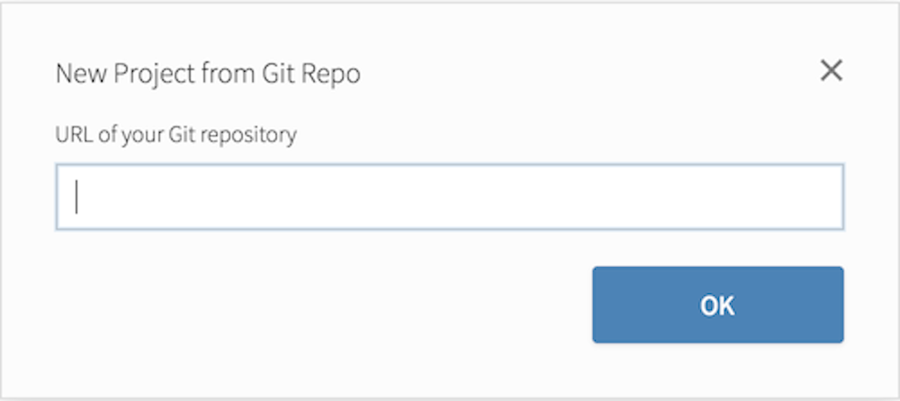

<div style= "float:right;position: relative; margin-left: 20px">
```{r setup, echo=FALSE, fig.align="right", out.width=500}
knitr::include_graphics("img/bike.jpg")
```
</div>

```{r include=FALSE}
library(tidyverse)
library(datasauRus)
options(
  htmltools.dir.version = FALSE, # for blogdown
  show.signif.stars = FALSE     # for regression output
  )
```


```{marginfigure}
Photo by Andhika Soreng on Unsplash.
```

The main goal of this assignment is to get you to practice working with Git and 
GitHub while doing simple data wrangling and visualization. Git is a version 
control system, and GitHub is the home for your Git-based projects on the internet.

# Getting started

Go to your email and accept the repo for this homework assignment. The name of 
the repo is `hw-03-ncbikecrash-GITHUBNAME`, where `GITHUBNAME` is your GitHub
username. This repo contains a template R Markdown file that you can build on 
to complete your assignment.  

## Cloning your repo

On GitHub, click on the green **Clone or download** button, select 
**Use HTTPS** (this might already be selected by default, and if it is, 
you'll see the text **Clone with HTTPS** as in the image below). Click on 
the clipboard icon to copy the repo URL.

```{r clone-repo-link, echo = FALSE, fig.width=3, fig.align="center"}

```

Go to RStudio Cloud and into the course workspace. Create a **New Project from Git Repo**. You will need to click on the down arrow next to the **New Project** button 
to see this option.

```{r new-project-from-gh, echo = FALSE, fig.width=3, fig.align="center"}
knitr::include_graphics("img/new-project-from-gh.png")
```

Copy and paste the URL of your assignment repo into the dialog box.

```{r paste-gh-repo-url, echo = FALSE, fig.width=4, fig.align="center"}

```

Hit OK, and you're good to go!

## Configuring Git

```{marginfigure}
Your email address is the address tied to your GitHub account and your name should be first and last name.
```

Before we can get started we need to take care of some required housekeeping. Specifically,  we need to configure your git so that RStudio can communicate with GitHub. This requires two pieces of information: your email address and your name.

The following screencast is a demo of what you need to do to configure your git.

<div style="position:relative;height:0;padding-bottom:40%"><iframe width="600" height="320" src="https://www.youtube.com/embed/nD6_3C-OZyM" frameborder="0" allow="autoplay; encrypted-media" allowfullscreen></iframe></div>

To do so, follow these steps:

- Go to the *Terminal* pane
- Type the following two lines of code, replacing the information in the quotation marks with your info:

```{bash eval=FALSE}
git config --global user.email "your email"
git config --global user.name "your name"
```

For example, for me these are

```{bash eval=FALSE}
git config --global user.email "mine@stat.duke.edu"
git config --global user.name "Mine Cetinkaya-Rundel"
```

To confirm that the changes have been implemented, run the following

```{bash eval=FALSE}
git config --global user.email
git config --global user.name
```

## Updating project name

Currently your project is called *Untitled Project*. Update the name of your project to be "HW 03 - NC Bike Crash".

```{r untitled-project, fig.fullwidth=TRUE, echo = FALSE}

```

## Your first commit

The following video is an overview of your first commit and push.

<div style="position:relative;height:0;padding-bottom:40%"><iframe width="600" height="320" src="https://www.youtube.com/embed/XE8h8jIyu04" frameborder="0" allow="autoplay; encrypted-media" allowfullscreen></iframe></div>

Open the R Markdown (Rmd) file in your project, in the YAML change the author 
name to your name, and knit the document.

```{r yaml-raw-to-rendered, fig.fullwidth=TRUE, echo = FALSE}

```

Then Go to the Git pane in your RStudio.

If you have made changes to your Rmd file, you should see it listed here. Click 
on it to select it in this list and then click on **Diff**. This shows you the 
*diff*erence between the last committed state of the document and its current 
state that includes your changes. If you're happy with these changes, write 
"Update author name" in the **Commit message** box and hit **Commit**.

```{r update-author-name-commit, fig.fullwidth=TRUE, echo = FALSE}
knitr::include_graphics("img/update-author-name-commit.png")
```

You don't have to commit after every change, this would get quite cumbersome. 
You should consider committing states that are *meaningful to you* for inspection, 
comparison, or restoration. In the first few assignments we will tell you 
exactly when to commit and in some cases, what commit message to use. As the 
semester progresses we will let you make these decisions.

## Pushing changes: 

Now that you have made an update and committed this change, it's time to push 
these changes to the web! Or more specifically, to your repo on GitHub. Why? 
So that others can see your changes. And by others, we mean the course teaching 
team (your repos in this course are private to you and us, only). 

In order to push your changes to GitHub, click on **Push**. This will prompt a 
dialogue box where you first need to enter your user name, and then your password. 
This might feel cumbersome. Bear with me... We *will* teach you how to save your 
password so you don't have to enter it every time. But for this one assignment 
you'll have to manually enter each time you push in order to gain some 
experience with it.

## Thought exercise:

For which of the above steps (changing project name, making updates to the 
document, committing, and pushing changes) do you need to have an internet 
connection? Discuss with your classmates.

# Analysis

## Packages

In this lab we will work with two packages: `tidyverse`, which is a collection 
of packages for doing data analysis in a "tidy" way and `dsbox`, which contains
the data we'll be using for the lab.

These packages have already been installed for you, and are loaded in your 
R Markdown file as well. Knit your R Markdown (Rmd) document and see the results.

If you'd like to run your code in the Console as well you'll also need to 
load the packages there. To do so, run the following in the console. 

```{r message = FALSE}
library(tidyverse) 
library(dsbox)
```

1. How many bike crashes were recorded in NC between 2007 and 2014? How many 
variables are recorded on these crashes? Use inline R code when answering this 
question.

*This is a good place to pause, commit changes with the commit message 
"Dimensions of data", and push. Make sure to commit and push all changed files.*

2. How many bike crashes occurred in residential development areas where the 
driver was between 0 and 19 years old?

*This is a good place to pause, commit changes with the commit message 
"Filter for residential and young driver", and push. Make sure to commit and 
push all changed files.*

```{marginfigure}
**Hint:** See the help for the `count()` function, specifically the 
`sort` argument for reporting the frequency table in descending order of counts, 
i.e. highest on top.
```

3. Create a frequency table of the estimated speed of the car (`driver_est_speed`) 
involved in the crash. What is the most common estimated speed range in the 
dataset?

Don't forget to label your R chunk as well (where it says `label-me-1`). Your 
label should be short, informative, and shouldn't include spaces. It also 
shouldn't repeat a previuous label, otherwise R Markdown will give you an 
error about repeated R chunk labels.

*This is a good place to pause, commit changes with the commit message 
"Most common estimated speed". Make sure to commit and push all changed files.*

4. Recreate the following plot, and describe in context of the data what it 
shows.

Don't forget to label your R chunk as well (where it says `label-me-2`). Your 
label should be short, informative, shouldn't include spaces, and shouldn't
shouldn't repeat a previuous label.

Play around with the `fig.height` and `fig.width` options in the R chunk 
definitions until you're satisfied with the dimensions of the figure.

```{r fig.width=7, fig.height=3, echo=FALSE}
ggplot(ncbikecrash, aes(x = crash_alcohol, fill = crash_severity)) +
  geom_bar(position = "fill") +
  coord_flip() +
  labs(y = "Proportion", x = "Did the crash involve alcohol?",
       fill = "Crash severity", 
       title = "Involvement of alcohol and severity of bike crashes")
```

*This is a good place to pause, commit changes with the commit message 
"Recreated crash severity and alcohol figure". Make sure to commit and push 
all changed files.*

```{marginfigure}
**Hint:** Instead of changing the legend, change how the data are represented 
in the `crash_severity` variable with `mutate()`.
```

5. Recreate the same figure, but this time change the labels of the crash 
severity variable such that text like `A:`, `B:`, etc. doesn't show up.

For this question you'll need to add an R chunk, label it, and define 
preferences for the figure's height and width.

```{marginfigure}
Not sure how to use emojis on your computer? Maybe a teammate can help? Or you 
can ask your TA as well!
```

*Yay, you're done! Commit all remaining changes, use the commit message 
"Recreated figure with cleaner labels, done with HW 3! `r emo::ji("muscle")`", 
and push. Before you wrap up the assignment, make sure all documents are 
updated on your GitHub repo.*
