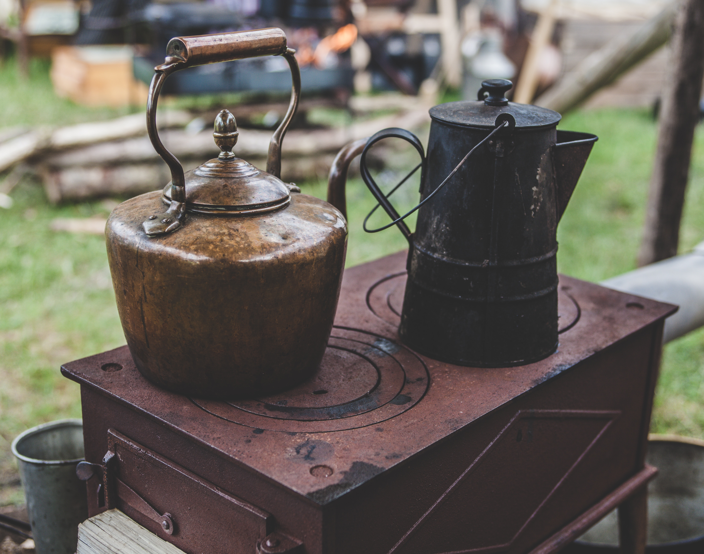

<div style= "float:right;position: relative; margin-left: 20px">
```{r icon, echo=FALSE, fig.align="right", out.width=500}

```
</div>

```{r setup, include=FALSE}
library(DT)
options(
  htmltools.dir.version = FALSE, # for blogdown
  show.signif.stars = FALSE      # for regression output
  )
knitr::opts_chunk$set(eval = TRUE, echo = FALSE)
```

```{marginfigure}
Photo by [Clem Onojeghuo](https://unsplash.com/@clemono2) on [Unsplash](https://unsplash.com/).
```

This data is based on real-life survey data collected by the World Bank under the umbrella of the Living Standards Measurement Survey project.This large initiative has collected survey data from developing countries since the 1980s (using comparable survey instruments) to better understand questions of health, education, poverty, employment and other indicators of well-being around the world. 

This exercise will guide you through the analysis of the well-being and livelihoods of individuals in 4 countries: Bulgaria, Tajikistan, Tanzania and Panama.

# Packages

In this assignment we will work with the `tidyverse`, `GGally`, and `knitr` 
packages. These packages should already be installed in your 
project, and you can load them with the following:

```{r load-packages, eval=TRUE, echo=TRUE, message=FALSE}
library(tidyverse)
library(GGally)
library(knitr)
```

# Creating a Poverty Index

In developing countries, income is not always a good measure of well-being. In agricultural societies, income is tied to harvest, and thus is sensitive to the season in which the surey is administered. Furthermore, income often does not capture in-kind revenue, and is a particularly poor measure for households that practice subsistence agriculture. 

For this reason, development experts will often use indices of poverty based on household assets, to better understand well-being levels. Household asset ownership does not vary seasonally, and is not tied to payment-type, making it a more stable and often preferred measure of poverty. 

The descriptive statistics of household assets showed variability in asset holdings across countries. How can we turn this into an index to determine the poverty level of households in our dataset?

# Principal Component Analysis

Principal Component Analysis (PCA) is one of the main ways we can turn this data into an index. It allows us to turn multidimensional data (in this case, all of our assets), into a single variable. The first component is a vector that explains the largest variation in asset holdings of households and is a linear transformation of our original assets data. Allows us to identify trends and compare accross households and countries.

1. Compute the correlation matrix for the assets. As a stretch goal, round the 
correlations to three decimal points, and try to make it print pretty with the 
`kable()` function.

Here is an example of what your correlation table can look like, but you should 
be creating your own.

```{r, echo = F, message=FALSE}
household <- read_csv("data/household-survey.csv")
#Principal component analysis
X = subset(household, select=c(stove,refrigerator,tv,bike,motorbike,
                        computer,car,video,stereo,sew))
#correlation pattern
C = cor(X)
knitr::kable(round(C,3))
```

2. Run the Principal Component Analysis using the function `prccomp()` 
function, and make the screeplot, and interpret it.

```{r, echo = F}
X = as_tibble(X)
pc = prcomp(X)
screeplot(pc, type="lines", main="Screeplot")
```

Notice that the goal here is not minimizing the loss of relevant information in the dataset, but rather finding a concise measure of wealth/poverty.

Remember the the first principal component $y_1$ is a linear combination of the original variables $(x_1,...,x_{10})$:
\begin{align*}
 y_1 = \mathbf{ a_1}^T \mathbf{x} = \sum_{j=1}^{10} a_{1,j} x_j
\end{align*}
In order to interpret the results we need to look at the coefficients $a_{1,j}$ with $j = 1,2,....,10$

```{r}
pc$rotation[,1]
```

3. How can we interpret the first component of our PCA, looking at the values listed above? (Hint: Is it a weighted average or a weighted difference?) Which assets are the most important in the first component of our PCA, as in - which ones are explaining the most variance? (Hint: Check which coefficients are larger than 0.15 in absolute value.) As a stretch goal, think about how our PCA might help us explain wealth levels across countries. With this in mind, why might the variable motorbike seem to be less important (in terms of contribution to total variance) than, for example, refrigerator? Go back to your asset-holding descriptive statistics from class to help answer this question. 

Now, the next goal is to find what are the drivers of poverty/wealth in different countries. So first of all, we want to have the index in terms of wealth - the higher, the richer. We need to multiply the principal component by $-1$, since the coefficients are all negative. 

4. Interpret the following histogram and boxplot by country? Which are the 
richest countries and which are the poorest? Which country has the most 
inequality?

```{r}
household <- household %>%
   mutate(
      pc1 = -1 * as.vector(pc$rotation[,1]%*%t(X))
   )

ggplot(household, aes(x = pc1, fill = country)) +
   geom_density(alpha = 0.45)
```

```{r}
ggplot(household, aes(x = country, y = pc1)) +
   geom_boxplot()
```

  
# Bibliography 

- The World Bank, Living Standards Measurement Study LSMS (2007). Bulgaria Multitopic Household Survey 2007 [BGR_2007_MTHS_v01_M]. Retrieved from http://microdata.worldbank.org/index.php/catalog/2273/study-description
 
- The World Bank, Living Standards Measurement Study - Integrated Surveys on Agriculture (2010-2011). Tanzania - National Panel Survey 2010-2011, Wave 2 [TZA_2010_NPS-R2_v01_M]. Retrieved from http://microdata.worldbank.org/index.php/catalog/1050
 
- The World Bank, Living Standards Measurement Study LSMS (2008). Panama - Encuesta de Niveles de Vida 2008 [PAN_2008_ENV_v01_M]. Retrieved from http://microdata.worldbank.org/index.php/catalog/70
 
- Tajikistan Statistical Agency, Living Standards Measurement Study LSMS (2009). Tajikistan - Living Standards Survey 2009 [TJK_2009_TLSS_v01_M]. Retrieved from http://microdata.worldbank.org/index.php/catalog/73[c1] 
