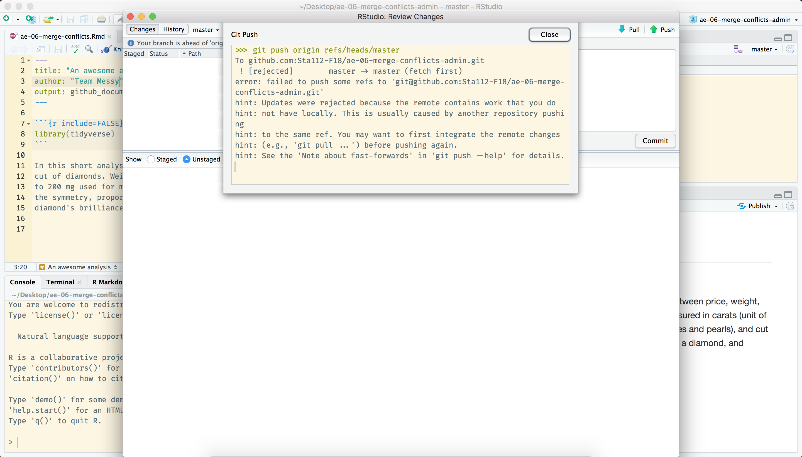
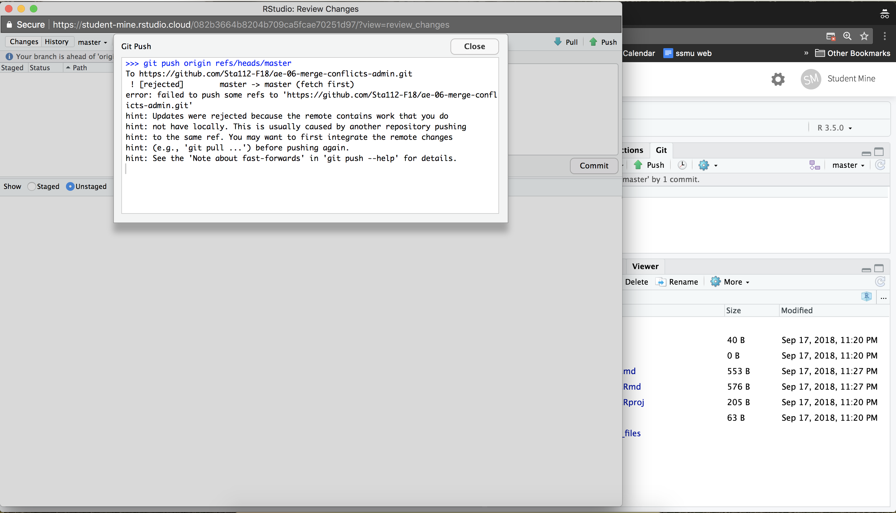
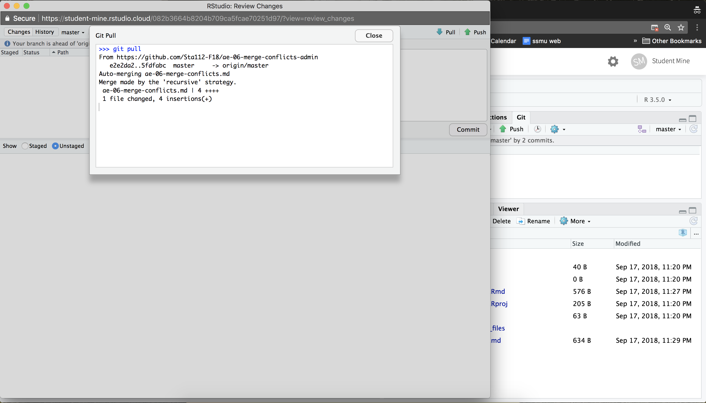

```{r child = "../setup.Rmd"}
```

```{r packages, echo=FALSE, message=FALSE, warning=FALSE}
library(tidyverse)
```

class: center, middle

# What is a merge conflict?

---

## Merge conflicts

When two collaborators make changes to a file and push the file to their repo, 
git merges these two files.

```{r echo=FALSE, out.width=400, fig.align="center"}
knitr::include_graphics("img/merge-no-conflict.png")
```

--

If these two files have conflicting content on the same line, git will produce a 
**merge conflict**.

```{r echo=FALSE, out.width=400, fig.align="center"}
knitr::include_graphics("img/merge-conflict.png")
```

---

## Resolving merge conflicts

- Merge conflicts need to be resolved manually, as they require a human intervention

```{r echo=FALSE, out.width=800, fig.align="center"}
knitr::include_graphics("img/merge-conflict-identifiers.png")
```

- To resolve the merge conflict
  - decide if you want to keep only your text or the text on GitHub or 
  incorporate changes from both texts
  - delete the conflict markers `<<<<<<<`, `=======`, `>>>>>>>` and make the 
  changes you want in the final merge

---

class: center, middle

# Application exercise

---

## <i class="fas fa-laptop"></i> AE 06 - Merge conflics

- Clone your assignment repo in RStudio Cloud (`ae-06-merge-conflics-TEAMNAME`), 
and open the R Markdown file.
- Assign the numbers 1, 2, 3, and 4 to each of the team members.
- Take turns in completing the exercise, only one member at a time:
.midi[
- Member 1: Change the team name to your team name, knit, commit, push.
- Member 2: Change the team name to something else, knit, commit, push. You 
will get an error. Pull. Review the document with the merge conflict. Resolve 
the conflict with the preferred change. Commit and push.
- Member 3: Create a plot displaying the relationship between `price` and `carat`, 
controlling for `cut` of the diamonds (see next slide for the plot). Knit, 
commit, push. You will get an error, read it, and pull. No merge conflicts should 
occur. Now push.
- Member 4: Set the `alpha` level to `0.5`. Knit, commit, push. You will get 
an error. Pull. Review the document with the merge conflict. Clear the 
merge conflict by choosing the correct/preferred change. Commit, and push.
- All members: Pull, and observe the changes in your document.
]

---

class: middle

Plot for Member 3 to recreate (the others can help of course!):

```{r echo=FALSE}
ggplot(data = diamonds, aes(x = carat, y = price, color = cut)) +
  geom_point()
```

---

class: center, middle

# Review

---

.question[
What does the following message mean?
]

<br>

```{r echo=FALSE, out.width=800, fig.align="center"}

```

---

.question[
What does the following message mean?
]

<br>

```{r echo=FALSE, out.width=800, fig.align="center"}

```

---

.question[
What does the following message mean?
]

<br>

```{r echo=FALSE, out.width=800, fig.align="center"}

```

---

.question[
What does the following message mean?
]

<br>

```{r echo=FALSE, out.width=800, fig.align="center"}

```

---

## Tips for collaborating via GitHub

- Always pull first before you start working.
- Commit, and push, often to minimize merge conflicts and/or to make merge conflicts easier to resolve.
- If you find yourself in a situation that is difficult to resolve, ask questions asap, don't let it linger and get bigger.
