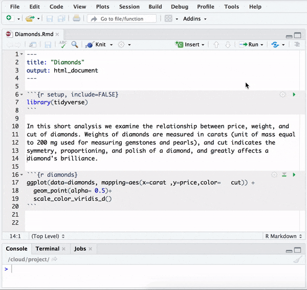

```{r child = "../setup.Rmd"}
```

```{r packages, echo=FALSE, message=FALSE, warning=FALSE}
library(tidyverse)
```


## Announcements

- Peer evaluations for your teammates due Friday (tomorrow!) evening
  - Look for an email from TEAMMATES after class, ping me/Eidan if you don't see 
  it in your inbox by this afternoon
- HW 05 due next Tuesday
- MT 01 assigned next Thursday, due following Tuesday

---

class: center, middle

# Coding style

---

## Style guide

>"Good coding style is like correct punctuation: you can manage without it, butitsuremakesthingseasiertoread."
>
>Hadley Wickham

- Style guide for this course is based on the Tidyverse style guide: http://style.tidyverse.org/
- There's more to it than what we'll cover today, but we'll mention more as we 
introduce more functionality, and do a recap later in the semester

---

## File names and code chunk labels

- Do not use spaces in file names and code chunk labels, use `-` or `_` to 
separate words
- Use all lowercase letters

```{r eval = FALSE}
# Good
ucb-admit.csv

# Bad
UCB Admit.csv
```

---

## Object names

- Use `_` to separate words in object names
- Use informative but short object names
- Do not reuse object names within an analysis

```{r eval = FALSE}
# Good
acs_employed

# Bad
acs.employed
acs2
acs_subset
acs_subsetted_for_males
```

---

## Spacing

- Put a space before and after all infix operators (=, +, -, <-, etc.), and when 
naming arguments in function calls
- Always put a space after a comma, and never before (just like in regular English)

```{r eval = FALSE}
# Good
average <- mean(feet / 12 + inches, na.rm = TRUE)

# Bad
average<-mean(feet/12+inches,na.rm=TRUE)
```

---

## ggplot2

- Always end a line with `+`
- Always indent the next line

```{r eval = FALSE}
# Good
ggplot(diamonds, mapping = aes(x = price)) +
  geom_histogram()

# Bad
ggplot(diamonds,mapping=aes(x=price))+geom_histogram()
```

---

## dplyr

- Always end a line with `%>%`, except for one-step pipes
- Always indent the next line

```{r eval = FALSE}
# Good
diamonds %>% filter(cut == "Fair")
diamonds %>% 
  filter(cut == "Fair") %>%
  summarise(mean_price = mean(price))

# Bad
diamonds %>% filter(cut == "Fair") %>% summarise(mean_price = mean(price))
diamonds %>% 
filter(cut == "Fair") %>%
summarise(mean_price = mean(price))
```

---

## ggplot2 + dplyr

- Further indent ggplot2 code following a dplyr pipeline

```{r eval = FALSE}
# Good
diamonds %>% 
  filter(cut == "Fair") %>%
  ggplot(aes(x = carat, y = price)) +
    geom_point() +
    labs(title = "Price vs. carat for fair diamonds")

# Bad
diamonds %>% 
  filter(cut == "Fair") %>%
  ggplot(aes(x = carat, y = price)) +
  geom_point() +
  labs(title = "Price vs. carat for fair diamonds")
```

---

## Long lines

- Limit your code to 80 characters per line. This fits comfortably on a printed 
page with a reasonably sized font
  - Tools $\rightarrow$ Global options $\rightarrow$ Display $\rightarrow$ check 
  Show margin
- Take advantage of RStudio editor's auto formatting for indentation at line breaks

---

## Assignment

- Use `<-` not `=`

```{r eval = FALSE}
# Good
x <- 2

# Bad
x = 2
```


---

## Quotes

- Use `"`, not `'`, for quoting text
- The only exception is when the text already contains double quotes and no 
single quotes

```{r eval = FALSE}
ggplot(diamonds, mapping = aes(x = price)) +
  geom_histogram() +
  # Good
  labs(title = "`Shine bright like a diamond`",
  # Good
       x = "Diamond prices",
  # Bad
       y = 'Frequency')
```

---

## Commenting

- Use comments sparingly, instead describe important findings and decisions in text
- If you need comments to explain what your code is doing, consider rewriting 
your code to be clearer
- Leave one space after `#` 
- Place comments above the code when possible

```{r}
# Good
x <- 2

x = 2#Bad
```


---

## `r emo::ji("package")` styler

.pull-left[
- The goal of **styler** is to provide non-invasive pretty-printing of R code 
adhering to the **tidyverse** formatting rules
- You can use the *Style selection* or *Style active file* addins to use 
the package functionality
  - But styler doesn't catch all deviations from the guidelines we outlined,  
  make sure to do a thorough review of your code!
]
.pull-right[
```{r echo=FALSE}

```
]

---

class: center, middle

# Application exercise

---

## <i class="fas fa-laptop"></i> AE 07 - Coding style

- Clone your assignment repo in RStudio Cloud (`ae-07-coding-style-TEAMNAME`), 
and open the R Markdown file.
- Review the document and make any stylistic corrections needed.

