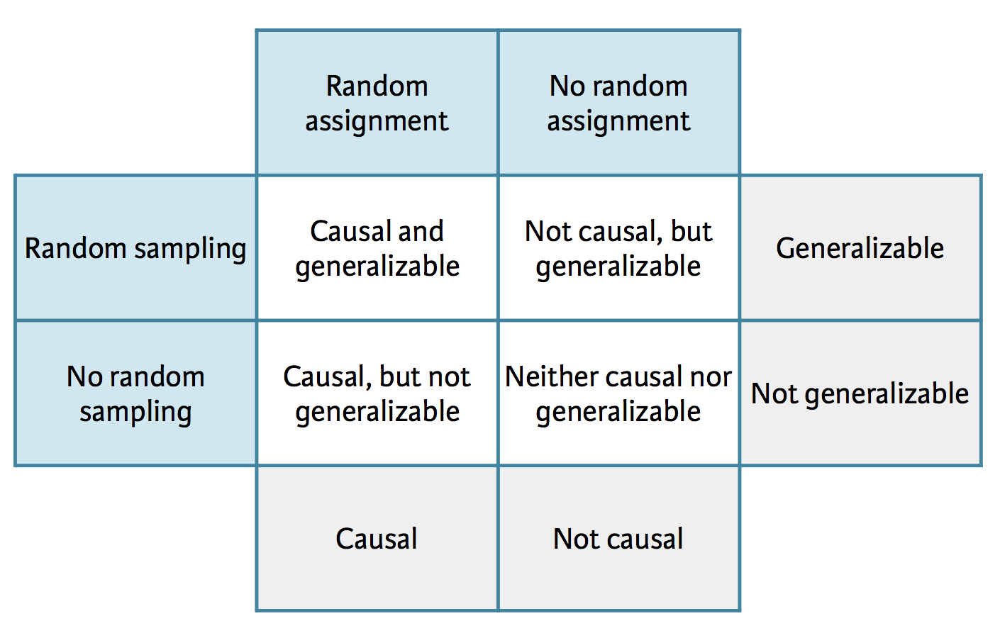

```{r child = "../setup.Rmd"}
```

```{r packages, echo=FALSE, message=FALSE, warning=FALSE}
library(tidyverse)
library(dsbox)
```

class: center, middle

# Announcements

---

## Announcements

- Reading 03 due Thursday
- MT 01 assigned Thursday after class, due in class on Tuesday


---

class: center, middle

# Scientific studies

---

## Scientific studies

- Observational
    - Collect data in a way that does not interfere with how the data arise ("observe")
    - Only establish an association
- Experimental
    - Randomly assign subjects to treatments
    - Establish causal connections

.question[
Design a study comparing average energy levels of people who do and do not exercise -- both as an observational study and as an experiment.
]

---

## Study: Bfast cereal keeps girls slim

.midi[
Girls who ate breakfast of any type had a lower average body mass index, a common obesity gauge, than those who said they didn't. The index was even lower for girls who said they ate cereal for breakfast, according to findings of the study conducted by the Maryland Medical Research Institute with funding from the National Institutes of Health (NIH) and cereal-maker General Mills.
 
[...]
 
The results were gleaned from a larger NIH survey of 2,379 girls in California, Ohio, and Maryland who were tracked between the ages of 9 and 19.
 
[...]
 
As part of the survey, the girls were asked once a year what they had eaten during the previous three days.
 
[...]
]

.question[
What is the explanatory and what is the response variable?
]

.footnote[
Souce: [Study: Cereal Keeps Girls Slim](https://www.cbsnews.com/news/study-cereal-keeps-girls-slim/), Retrieved Sep 13, 2018.
]

---

### 3 possible explanations

--

- Eating breakfast causes girls to be slimmer 

--
- Being slim causes girls to eat breakfast

--
- A third variable is responsible for both -- a **confounding** variable: an extraneous variable that affects both the explanatory and the response variable, and that make it seem like there is a relationship between them

---

## Correlation != causation

<br><br>
.center[

]
<br><br>

.footnote[
Randall Munroe CC BY-NC 2.5 http://xkcd.com/552/
]

---

## Studies and conclusions



---

class: center, middle

# Conditional probability

---

## Conditional probability

**Notation**: $P(A | B)$: Probability of event A given event B

- What is the probability that it be unseasonably warm tomorrow?
- What is the probability that it be unseasonably warm tomorrow, given that it it was unseasonably warm tomorrow?

---

.question[
A January 2018 SurveyUSA poll asked 500 randomly selected Californians whether they are familiar with the DREAM act. The distribution of the responses by age category are shown below.

What percent of **all respondents** are very familiar with the DREAM act?  
]
<br>
.pull-left[
|            | 18 - 49 | 50+ | Total |
|------------|---------|-----|-------|
| Very       | 90      | 32  | 122   |
| Somewhat   | 125     | 86  | 211   |
| Not very   | 56      | 33  | 89    |
| Not at all | 36      | 24  | 60    |
| Not sure   | 9       | 9   | 18    |
| Total      | 316     | 184 | 500   |
]
--
.pull-right[
$P(Very) = \frac{122}{500} = 0.244$
]

<br>

.footnote[
Source: [SurveyUSA News Poll 23754](http://www.surveyusa.com/client/PollReport.aspx?g=783743b0-efc1-4b67-9201-58352a8f61f1)
]

---

.question[
A January 2018 SurveyUSA poll asked 500 randomly selected Californians whether they are familiar with the DREAM act. The distribution of the responses by age category are shown below.

What percent of **respondents who are 18 - 49 years old** are very familiar with the DREAM act?
]
<br>
.pull-left[
|            | 18 - 49 | 50+ | Total |
|------------|---------|-----|-------|
| Very       | 90      | 32  | 122   |
| Somewhat   | 125     | 86  | 211   |
| Not very   | 56      | 33  | 89    |
| Not at all | 36      | 24  | 60    |
| Not sure   | 9       | 9   | 18    |
| Total      | 316     | 184 | 500   |
]
--
.pull-right[
$P(Very~|~18-49) = \frac{90}{316} = 0.285$
]

---

.question[
A January 2018 SurveyUSA poll asked 500 randomly selected Californians whether they are familiar with the DREAM act. The distribution of the responses by age category are shown below.

What percent of **respondents who are 50+ years old** are very familiar with the DREAM act?
]
<br>
.pull-left[
|            | 18 - 49 | 50+ | Total |
|------------|---------|-----|-------|
| Very       | 90      | 32  | 122   |
| Somewhat   | 125     | 86  | 211   |
| Not very   | 56      | 33  | 89    |
| Not at all | 36      | 24  | 60    |
| Not sure   | 9       | 9   | 18    |
| Total      | 316     | 184 | 500   |
]
--
.pull-right[
$P(Very~|~50+) = \frac{32}{184} = 0.173$
]

---

.question[
Given that

- $P(Very) = \frac{122}{500} = 0.244$
- $P(Very~|~18-49) = \frac{90}{316} = 0.285$
- $P(Very~|~50+) = \frac{32}{184} = 0.173$

does there appear to be a relationship between age and familiarity with the DREAM act? Explain your reasoning.
]

--

<br>

.question[
Could there be another variable that explains this relationship?
]

---

## Independence

.question[
Inspired by the previous example and how we used the conditional probabilities to make conclusions, come up with a definition of independent events. If easier, you can keep the context limited to the example (independence/dependence of familiarity with the DREAM act and age), but try to push yourself to make a more general statement.
]

---

class: center, middle

# Simpson's paradox

---

## Relationships between variables

- Bivariate relationship: Fitness $\rightarrow$ Heart health
- Multivariate relationship: Calories + Age + Fitness $\rightarrow$ Heart health

---

## Simpson's paradox

- Not considering an important variable when studying a relationship can result in what we call a **Simpson's paradox**, which illustrates the effect the omission of an explanatory variable can have on the measure of association between another explanatory variable and a response variable. 
- In other words, the inclusion of a third variable in the analysis can change the apparent relationship between the other two variables. 

```{r echo=FALSE, message=FALSE, fig.height=2, fig.align="center"}
df <- tribble(
  ~x1, ~y, ~x2,
  2,   4,  0,
  3,   3,  0,
  4,   2,  0,
  5,   1,  0,
  6,   11, 1,
  7,   10, 1,
  8,   9,  1,
  9,   8,  1
)
ggplot() +
  geom_point(data = df, aes(x1, y, color = factor(x2))) +
  geom_smooth(data = df, aes(x1, y, color = factor(x2)), method = lm) +
  geom_smooth(data = df, aes(x1, y), method = lm, se = FALSE, 
              color = "black", linetype = "dashed") +
  labs(color = "x2")
```


---

## Berkeley admission data

- Study carried out by the graduate Division of the University of California, Berkeley in the early 70’s to evaluate whether there was a sex bias in graduate admissions.
- The data come from six departments. For confidentiality we'll call them A-F. 
- We have information on whether the applicant was male or female and whether they were admitted or rejected. 
- First, we will evaluate whether the percentage of males admitted is indeed higher than females, overall. Next, we will calculate the same percentage for each department.

---

## Data

The data are in the `ucbadmit` data frame in the `dsbox` package:

```{r message=FALSE}
glimpse(ucbadmit)
```

---

## Overall gender distribution

.question[
What can you say about the overall gender distribution? Hint: Calculate the following probabilities: $P(Admit | Male)$ and $P(Admit | Female)$.
]

```{r}
ucbadmit %>%
  count(gender, admit)
```

---

## Overall gender distribution

.question[
What do these proportions mean, and how are they calculated?
]

```{r echo=FALSE}
ucbadmit %>%
  count(gender, admit) %>%
  group_by(gender) %>%
  mutate(prop_admit = n / sum(n))
```

---

## Overall gender distribution

```{r}
ucbadmit %>%
  count(gender, admit) %>%
  group_by(gender) %>%
  mutate(prop_admit = n / sum(n))
```

--

<br>

.question[
What type of visualization would be appropriate for representing these data?
]

---

## Overall gender distribution

```{r echo=FALSE, fig.height=2, fig.width=5}
ggplot(ucbadmit, mapping = aes(x = gender, fill = admit)) +
  geom_bar(position = "fill") +
  labs(x = "", y = "", fill = "", title = "Admissions by gender") +
  coord_flip()
```

---

## Gender distribution, by department

```{r}
ucbadmit %>%
  count(dept, gender, admit)
```

---

## Gender distribution, by department

```{r echo=FALSE}
ucbadmit %>%
  count(dept, gender, admit) %>%
  group_by(dept, gender) %>%
  mutate(perc_admit = n / sum(n)) %>%
  filter(admit == "Admitted")
```

---

## Gender distribution, by department

```{r}
ucbadmit %>%
  count(dept, gender, admit) %>%
  group_by(dept, gender) %>%
  mutate(perc_admit = n / sum(n)) %>%
  filter(admit == "Admitted")
```

---

## Gender distribution, by department

.question[
What type of visualization would be appropriate for representing these data?
]

```{r echo=FALSE}
ucbadmit %>%
  count(dept, gender, admit) %>%
  group_by(dept, gender) %>%
  mutate(perc_admit = n / sum(n)) %>%
  filter(admit == "Admitted")
```

---

## Gender distribution, by department

```{r fig.width=7, fig.height=3}
ggplot(ucbadmit, mapping = aes(x = gender, fill = admit)) +
  geom_bar(position = "fill") +
  facet_wrap(. ~ dept) +
  coord_flip() +
  labs(x = "", y = "", fill = "",
       title = "Admissions by gender and department") +
  theme(legend.position = "bottom")
```

---

.question[
What do these two visualizations say about the gender distribution of students admitted to graduate school?
]

```{r echo=FALSE, fig.height=1.5, fig.width=7}
ggplot(ucbadmit, mapping = aes(x = gender, fill = admit)) +
  geom_bar(position = "fill") +
  labs(x = "", y = "", fill = "", title = "Admissions by gender") +
  coord_flip()
```

```{r echo=FALSE, fig.height=2.5, fig.width=7}
ggplot(ucbadmit, mapping = aes(x = gender, fill = admit)) +
  geom_bar(position = "fill") +
  facet_wrap(. ~ dept) +
  labs(x = "", y = "", fill = "", title = "Admissions by gender and department") +
  guides(fill = FALSE) +
  coord_flip()
```

---

class: center, middle

# group_by

---

## What does group_by() do?

`group_by()` takes an existing `tbl` and converts it into a grouped `tbl` where operations are performed "by group":

.pull-left[
```{r}
ucbadmit
```
]
.pull-right[
```{r}
ucbadmit %>% 
  group_by(gender)
```
]

---

## What does group_by() not do?

`group_by()` does not sort the data, `arrange()` does:

.pull-left[
```{r}
ucbadmit %>% 
  group_by(gender)
```
]
.pull-right[
```{r}
ucbadmit %>% 
  arrange(gender)
```
]

---

## What does group_by() not do?

`group_by()` does not create frequency tables, `count()` does:

.pull-left[
```{r}
ucbadmit %>% 
  group_by(gender)
```
]
.pull-right[
```{r}
ucbadmit %>% 
  count(gender)
```
]

---

## Undo grouping with ungroup()

.pull-left[
```{r}
ucbadmit %>%
  count(gender, admit) %>%
  group_by(gender) %>%
  mutate(prop_admit = n / sum(n)) %>%
  select(gender, prop_admit)
```
]
.pull-right[
```{r}
ucbadmit %>%
  count(gender, admit) %>%
  group_by(gender) %>%
  mutate(prop_admit = n / sum(n)) %>%
  select(gender, prop_admit) %>%
  ungroup()
```
]

---

class: center, middle

# count

---

## count() is a short-hand

`count()` is a short-hand for `group_by()` and then `summarise()` to count the number of observations in each group:

.pull-left[
```{r}
ucbadmit %>%
  group_by(gender) %>%
  summarise(n = n()) 
```
]
.pull-right[
```{r}
ucbadmit %>%
  count(gender)
```
]

---

## count can take multiple arguments

.pull-left[
```{r}
ucbadmit %>%
  group_by(gender, admit) %>%
  summarise(n = n()) 
```
]
.pull-right[
```{r}
ucbadmit %>%
  count(gender, admit)
```
]

--

.question[
What is the difference between the two outputs?
]

--

- `count()` ungroups after itself
- `summarise()` peels off one layer of grouping
- The question mark just means that the number of groups is unkown right now, it will only be computed when/if the next line is executed

---

## tally() is also a short-hand

`tally()` is a short-hand for `summarise()`

.pull-left[
```{r}
ucbadmit %>%
  tally()
```
]
.pull-right[
```{r}
ucbadmit %>%
  summarise(n  = n())
```
]

--

<br>

.question[
What is the relationship between `count()` and `tally()`?
]

---

## Relationship between count() and tally()

`count()` is also a short-hand for `group_by()` and then `tally()`:

.pull-left[
```{r}
ucbadmit %>%
  group_by(admit) %>%
  tally()
```
]
.pull-right[
```{r}
ucbadmit %>%
  count(admit)
```
]

