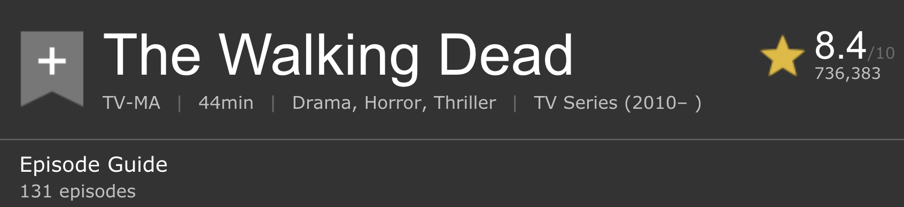

```{r setup, child = "../setup.Rmd"}
```

```{r packages, echo=FALSE, message=FALSE, warning=FALSE}
library(tidyverse)
library(rvest)
library(knitr)
```

class: center, middle

# Functions

---

## Setup

```{r read-page, message=FALSE}
library(tidyverse)
library(rvest)

st <- read_html("http://www.imdb.com/title/tt4574334/")
twd <- read_html("http://www.imdb.com/title/tt1520211/")
got <- read_html("http://www.imdb.com/title/tt0944947/")
```


---

## Why functions?

- Automate common tasks in a powerful and general way than copy-and-pasting:
    - You can give a function an evocative name that makes your code easier to understand.
    - As requirements change, you only need to update code in one place, instead of many.
    - You eliminate the chance of making incidental mistakes when you copy and paste (i.e. updating a variable name in one place, but not in another).

--

- Down the line: Improve your reach as a data scientist by writing functions (and packages!) that others use

---

## When should you write a function?

Whenever you’ve copied and pasted a block of code more than twice.

<br>

--

.question[
Do you see any problems in the code below?
]

.midi[
```{r episode-count-no-fn, eval=FALSE}
st_episodes <- st %>%
  html_nodes(".np_right_arrow .bp_sub_heading") %>%
  html_text() %>%
  str_replace(" episodes", "") %>%
  as.numeric()

got_episodes <- got %>%
  html_nodes(".np_right_arrow .bp_sub_heading") %>%
  html_text() %>%
  str_replace(" episodes", "") %>%
  as.numeric()

twd_episodes <- got %>%
  html_nodes(".np_right_arrow .bp_sub_heading") %>%
  html_text() %>%
  str_replace(" episodes", "") %>%
  as.numeric()
```
]

---

## Inputs

.question[
How many inputs does the following code have?
]

```{r episode-count-no-fn-st, eval=FALSE}
st_episodes <- st %>%
  html_nodes(".np_right_arrow .bp_sub_heading") %>%
  html_text() %>%
  str_replace(" episodes", "") %>%
  as.numeric()
```

---

## Turn your code into a function

- Pick a short but informative **name**, preferably a verb.

<br>
<br>
<br>
<br>
<br>

```{r build-fn-1, eval=FALSE}
scrape_episodes <- 
  
  
  
  
  
  
```

---

## Turn your code into a function

- Pick a short but informative **name**, preferably a verb.
- List inputs, or **arguments**, to the function inside `function`. If we had more the call would look like `function(x, y, z)`.

<br>
<br>

```{r build-fn-2, eval=FALSE}
scrape_episodes <- function(x){
  
  
  
  
  
}  
```

---

## Turn your code into a function

- Pick a short but informative **name**, preferably a verb.
- List inputs, or **arguments**, to the function inside `function`. If we had more the call would look like `function(x, y, z)`.
- Place the **code** you have developed in body of the function, a `{` block that immediately follows `function(...)`.

```{r build-fn-3}
scrape_episodes <- function(x){
  x %>%
    html_nodes(".np_right_arrow .bp_sub_heading") %>%
    html_text() %>%
    str_replace(" episodes", "") %>%
    as.numeric()
}
```

--

```{r episode-count-fn-st}
scrape_episodes(st)
```

---

## Check your function

```{r twd-img, echo=FALSE, out.height=120}

```

```{r episode-count-fn-twd}
scrape_episodes(twd)
```

```{r got-img, echo=FALSE, out.height=120}

```

```{r episode-count-fn-got}
scrape_episodes(got)
```

---

## Naming functions

> "There are only two hard things in Computer Science: cache invalidation and naming things." - Phil Karlton


--
- Names should be short but clearly evoke what the function does

--
- Names should be verbs, not nouns

--
- Multi-word names should be separated by underscores (`snake_case` as opposed to `camelCase`)

--
- A family of functions should be named similarly (`scrape_title`, `scrape_episode`, `scrape_genre`, etc.)

--
- Avoid overwriting existing (especially widely used) functions

---

.small[
```{r scrape-show-info-from-page-1}
scrape_show_info <- function(x){
  
  title <- x %>%
    html_node("#title-overview-widget h1") %>%
    html_text() %>%
    str_trim()
  
  genres <- x %>%
    html_nodes(".see-more.canwrap~ .canwrap a") %>%
    html_text() %>%
    str_trim() %>%
    paste(collapse = ", ")
  
  runtime <- x %>%
    html_node("time") %>%
    html_text() %>%
    str_replace("\\n", "") %>%
    str_trim()
  
  episodes <- x %>%
    html_nodes(".np_right_arrow .bp_sub_heading") %>%
    html_text() %>%
    str_replace(" episodes", "") %>%
    as.numeric()
    
  keywords <- x %>%
    html_nodes(".itemprop") %>%
    html_text() %>%
    str_trim() %>%
    paste(collapse = ", ")
  
  tibble(title = title, runtime = runtime, genres = genres,
         episodes = episodes, keywords = keywords)
  
}
```
]

---

.midi[
```{r scrape-show-info-from-page-ex}
scrape_show_info(st) %>% glimpse()
scrape_show_info(twd) %>% glimpse()
scrape_show_info(got) %>% glimpse()
```
]
---

.question[
How would you update the following function to use the URL of the page as an argument?
]

.xsmall[
```{r scrape-show-info-from-page-2, eval=FALSE}
scrape_show_info <- function(x){

  title <- x %>%
    html_node("#title-overview-widget h1") %>%
    html_text() %>%
    str_trim()
  
  genres <- x %>%
    html_nodes(".see-more.canwrap~ .canwrap a") %>%
    html_text() %>%
    str_trim() %>%
    paste(collapse = ", ")
  
  runtime <- x %>%
    html_node("time") %>%
    html_text() %>%
    str_replace("\\n", "") %>%
    str_trim()
  
  episodes <- x %>%
    html_nodes(".np_right_arrow .bp_sub_heading") %>%
    html_text() %>%
    str_replace(" episodes", "") %>%
    as.numeric()
    
  keywords <- x %>%
    html_nodes(".itemprop") %>%
    html_text() %>%
    str_trim() %>%
    paste(collapse = ", ")
  
  tibble(title = title, runtime = runtime, genres = genres,
         episodes = episodes, keywords = keywords)
  
}
```
]

---

.small[
```{r scrape-show-info-from-url}
scrape_show_info <- function(x){
  
  y <- read_html(x) #<<

  title <- y %>% #<<
    html_node("#title-overview-widget h1") %>%
    html_text() %>%
    str_trim()
  
  genres <- y %>% #<<
    html_nodes(".see-more.canwrap~ .canwrap a") %>%
    html_text() %>%
    str_trim() %>%
    paste(collapse = ", ")
  
  runtime <- y %>% #<<
    html_node("time") %>%
    html_text() %>%
    str_replace("\\n", "") %>%
    str_trim()
  
  episodes <- y %>% #<<
    html_nodes(".np_right_arrow .bp_sub_heading") %>%
    html_text() %>%
    str_replace(" episodes", "") %>%
    as.numeric()
    
  keywords <- y %>% #<<
    html_nodes(".itemprop") %>%
    html_text() %>%
    str_trim() %>%
    paste(collapse = ", ")
  
  tibble(title = title, runtime = runtime, genres = genres,
         episodes = episodes, keywords = keywords)
  
}
```
]

---

## Let's check

.small[
```{r episode-urls}
st_url <- "http://www.imdb.com/title/tt4574334/"
twd_url <- "http://www.imdb.com/title/tt1520211/"
got_url <- "http://www.imdb.com/title/tt0944947/"
```
]
--
.small[
```{r scrape-show-info-from-url-ex}
scrape_show_info(st_url)
scrape_show_info(twd_url)
scrape_show_info(got_url)
```
]

---

class: center, middle

# Automation

---

.question[
You now have a function that will scrape the relevant info on shows given its URL. Where can we get a list of URLs of top 100 most popular TV shows on IMDB? Write the code for doing this in your teams.
]

---

```{r scrape-urls, cache=TRUE}
urls <- read_html("http://www.imdb.com/chart/tvmeter") %>%
  html_nodes(".titleColumn a") %>%
  html_attr("href") %>%
  paste("http://www.imdb.com", ., sep = "")
```

```{r show-urls, echo=FALSE}
urls
```

---

## Go to each page, scrape show info 

Now we need a way to programatically direct R to each page on the `urls` list and run the `scrape_show_info` function on that page.

.midi[
```{r scrape-show-info-ex}
scrape_show_info(urls[1])
scrape_show_info(urls[2])
scrape_show_info(urls[3])
```
]

---

class: center, middle

.large[
*uh oh, we're repeating our~~selves~~ code again*
]

---

## Automation

- We need a way to programmatically repeat the code
- We have two options for doing this:
  - using a `for` loop
  - `map`ping with functional programming

---

## `for` loops

- `for` loops are the simplest and most common type of loop in R 
- Given a vector iterate through the elements and evaluate the code block for each

<br>

**Goal:** Scrape info from individual pages of TV shows using iteration with 
for loops. To keep things simple while developing the code, narrow down focus 
to the first `n = 5` shows only.

---

## `for` loop: 

### (1) Set up a tibble to store results

```{r}
n <- 5
top_n_shows <- tibble(title = rep(NA,n), runtime = rep(NA,n), 
                      genres = rep(NA,n), episodes = rep(NA,n), 
                      keywords = rep(NA,n)
  )
top_n_shows
```

---

## `for` loop: 

### (2) Iterate through urls to scrape data and save results

```{r}
for (i in 1:n){
  top_n_shows[i, ] = scrape_show_info(urls[i])
}

top_n_shows
```

---

## `map`ping

- `map` functions transform their input by applying a function to each element and returning an object the same length as the input

--
- There are various map functions (e.g. `map_lgl()`, `map_chr()`, `map_dbl()`, `map_df()`), each of which return a different type of object (logical, character, double, and data frame, respectively)

--
- `map` the `scrape_show_info` function to each element of `urls`

--
- This will hit the `urls` one after another, and grab the info

**Goal:** Scrape info from individual pages of TV shows using functional 
programming with mapping. To keep things simple while developing the code, 
narrow down focus to the first `n = 5` shows only.

---

## `map`ping: 

```{r}
top_n_shows <- map_df(urls[1:n], scrape_show_info)
top_n_shows
```

---

## Slow your roll

- If you get `HTTP Error 429 (Too man requests)` you might want to slow down your hits
- You can add a `Sys.sleep()` call to slow down your function:

```{r sys-sleep, eval=FALSE}
scrape_show_info <- function(x){

  Sys.sleep(runif(1)) #<<
  
  ...

}
```
