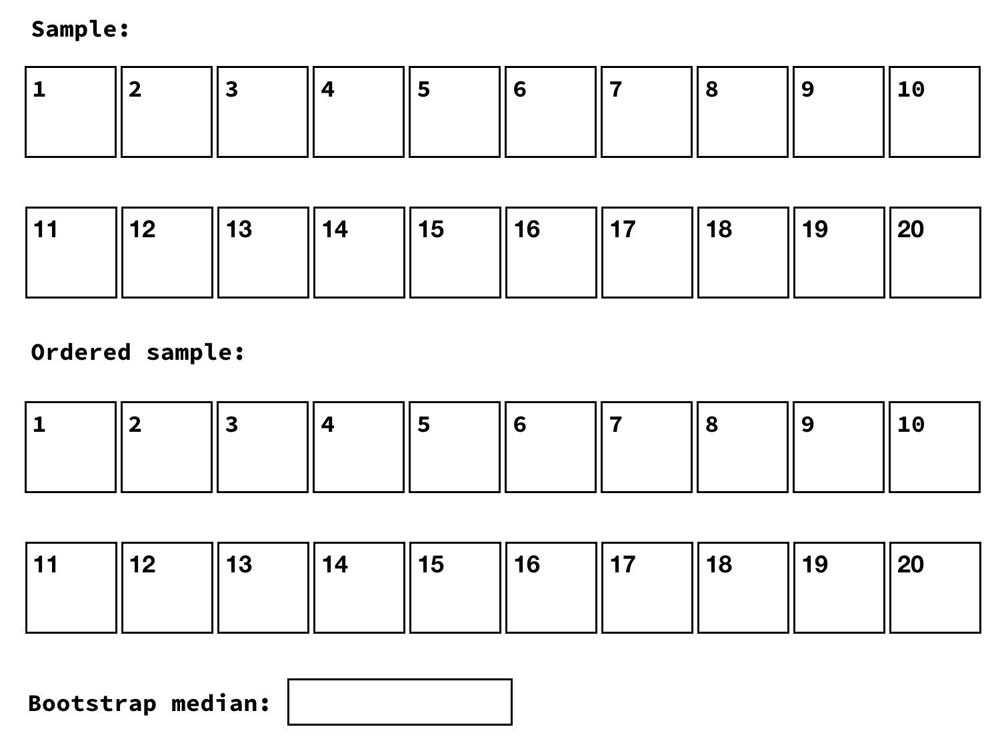
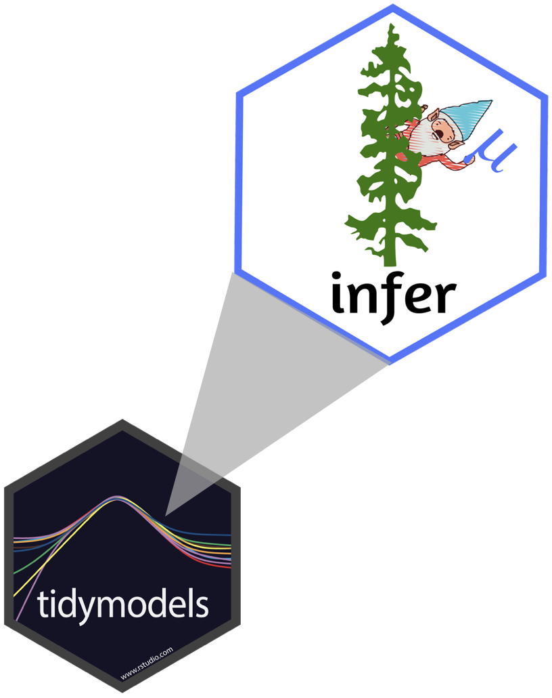

```{r setup, child = "../setup.Rmd"}
```

```{r packages, echo=FALSE, message=FALSE, warning=FALSE}
library(tidyverse)
#conflict_prefer("filter", "dplyr")
library(broom)
library(DT)
```

class: center, middle

# Inference

---

# Inference

.question[
What does inference mean?
]

--

- Statistical inference is the process of using sample data to make conclusions 
about the underlying population the sample came from
- Types of inference: testing and estimation
- Today we discuss estimation, next time testing

---


class: center, middle

# Confidence intervals

---

## Confidence intervals

A plausible range of values for the population parameter is a **confidence interval**.

.pull-left[

]
.pull-right[

]

- If we report a point estimate, we probably won’t hit the exact population 
parameter.
- If we report a range of plausible values we have a good shot at capturing 
the parameter.

---

## Variability of sample statistics

- In order to construct a confidence interval we need to quantify the variability 
of our sample statistic.
- For example, if we want to construct a confidence interval for a population mean, 
we need to come up with a plausible range of values around our observsed sample mean.
- This range will depend on how precise and how accurate our sample mean is as an 
estimate of the population mean.
- Quantifying this requires a measurement of how much we would expect the sample 
mean to vary from sample to sample.

--

.question[
Suppose you randomly sample 50 students and 5 of them are left handed. If you 
were to take another random sample of 50 students, how many would you expect to 
be left handed? Would you be surprised if only 3 of them were left handed? Would 
you be surprised if 40 of them were left handed?
]

---

## Quantifying the variability of a sample statistic

We can quantify the variability of sample statistics using

- simulation: via bootstrapping (today)

or

- theory: via Central Limit Theorem (later in the course)

---

class: center, middle

# Bootstrapping

---

## Bootstrapping


- The term **bootstrapping** comes from the phrase "pulling oneself up by one’s 
bootstraps", which is a metaphor for accomplishing an impossible task without 
any outside help.
- In this case the impossible task is estimating a population parameter, and we’ll 
accomplish it using data from only the given sample.
- Note that this notion of saying something about a population parameter using 
only information from an observed sample is the crux of statistical inference, 
it is not limited to bootstrapping.

---

## Rent in Manhattan

.question[
How much do you think a typical 1 BR apartment in Manhattan rents for?
]

---

## Sample

On a given day, twenty 1 BR apartments were randomly selected on Craigslist 
Manhattan from apartments listed as "by owner".

```{r message=FALSE}
library(tidyverse)
manhattan <- read_csv("data/manhattan.csv")
```

```{r}
manhattan %>% slice(1:10)
```

---

## Parameter of interest

.question[
`r emo::ji("bust_in_silhouette")` Is the mean or the median a better measure of 
typical rent in Manhattan?
]

.small[
```{r message=FALSE, echo=FALSE}
ggplot(data = manhattan, mapping = aes(x = rent)) +
  geom_histogram(binwidth = 250) +
  labs(title = "Rent of 1 BR apartments in Manhattan")
```
]

---

## Observed sample vs. bootstrap population

.pull-left[

Sample median = $`r manhattan %>% summarise(med_rent = median(rent)) %>% pull()` `r emo::ji("scream")`
]

--

.pull-right[

Population median = `r emo::ji("question")`
]

---

## Bootstrapping scheme

1. Take a bootstrap sample - a random sample taken with replacement from the 
original sample, of the same size as the original sample.
2. Calculate the bootstrap statistic - a statistic such as mean, median, 
proportion, slope, etc. computed on the bootstrap samples.
3. Repeat steps (1) and (2) many times to create a bootstrap distribution - 
a distribution of bootstrap statistics.
4. Calculate the bounds of the XX% confidence interval as the middle XX% 
of the bootstrap distribution.

---

## Let's bootstrap




---

class: center, middle

# Bootstrapping in R

---

## Two ways

1. Using `for` loops
2. Using the **infer** package


---

## Bootstrapping with `for` loops

.question[
Work in groups to explain what is happening in each line of the code below.
]

```{r}
set.seed(11012018)

boot_df <- tibble(
  replicate = 1:15000,
  stat = rep(NA, 15000)
  )

for (i in 1:15000){
   boot_df$stat[i] <- manhattan %>% 
     sample_n(20, replace = TRUE) %>% 
     summarise(stat = median(rent)) %>% 
     pull()
}
```

---

## Bootstrap results

```{r fig.height=2}
ggplot(boot_df, aes(x = stat)) +
  geom_histogram(binwidth = 50)
```

.pull-left[
.small[
```{r eval=FALSE}
boot_df %>%
  summarise(
    lower = quantile(stat, 0.025),
    upper = quantile(stat, 0.975),
    )
```
]
]
.pull-right[
```{r echo=FALSE}
boot_df %>%
  summarise(
    lower = quantile(stat, 0.025),
    upper = quantile(stat, 0.975),
    )
```
]

---

## modelr $\in$ tidyverse

.pull-left[

]
.pull-right[
The objective of `infer` is to perform statistical inference using an expressive statistical grammar that coheres with the `tidyverse` design framework.
```{r}
library(infer)
```
]

.footnote[
[infer.netlify.com](https://infer.netlify.com/)
]

---

## Generate bootstrap medians

```{r eval=FALSE}
manhattan %>%
  # specify the variable of interest
  specify(response = rent)
```

---

## Generate bootstrap medians

```{r eval=FALSE}
manhattan %>%
  # specify the variable of interest
  specify(response = rent)
  # generate 15000 bootstrap samples
  generate(reps = 15000, type = "bootstrap")
```

---

## Generate bootstrap medians

```{r eval=FALSE}
manhattan %>%
  # specify the variable of interest
  specify(response = rent)
  # generate 15000 bootstrap samples
  generate(reps = 15000, type = "bootstrap")
  # calculate the median of each bootstrap sample
  calculate(stat = "median")
```

---

## Generate bootstrap medians

```{r}
# save resulting bootstrap distribution
boot_df <- manhattan %>%
  # specify the variable of interest
  specify(response = rent) %>% 
  # generate 15000 bootstrap samples
  generate(reps = 15000, type = "bootstrap") %>% 
  # calculate the median of each bootstrap sample
  calculate(stat = "median")
```

---

## The bootstrap sample

.question[
How many observations are there in `boot_df`? What does each observation represent?
]

```{r}
boot_df
```

---

## Visualize the bootstrap distribution

```{r}
ggplot(data = rent_ci_med, mapping = aes(x = stat)) +
  geom_histogram(binwidth = 50) +
  labs(title = "Bootstrap distribution of medians")
```

---

## Calculate the confidence interval

A 95% confidence interval is bounded by the middle 95% of the bootstrap distribution.

```{r}
boot_df %>%
  summarize(lower = quantile(stat, 0.025),
            upper = quantile(stat, 0.975))
```

---

## Visualize the confidence interval

```{r include=FALSE}
# for using these values later
lower_bound <- rent_ci_med %>% summarize(lower_bound = quantile(stat, 0.025)) %>% pull()
upper_bound <- rent_ci_med %>% summarize(upper_bound = quantile(stat, 0.975)) %>% pull()
```

```{r echo=FALSE}
ggplot(data = rent_ci_med, mapping = aes(x = stat)) +
  geom_histogram(binwidth = 50) +
  geom_vline(xintercept = c(lower_bound, upper_bound), 
             color = "#A7D5E8", lty = 2) +
  labs(title = "Bootstrap distribution of medians",
       subtitle = "and 95% confidence interval")
```

---

## Interpret the confidence interval

.question[
The 95% confidence interval for the median rent of one bedroom apartments in 
Manhattan was calculated as (`r lower_bound`, `r upper_bound`). Which of the 
following is the correct interpretation of this interval?
]

(a) 95% of the time the median rent one bedroom apartments in this sample is between $`r lower_bound` and $`r upper_bound`.

(b) 95% of all one bedroom apartments in Manhattan have rents between $`r lower_bound` and $`r upper_bound`.

(c) We are 95% confident that the median rent of all one bedroom apartments is between $`r lower_bound` and $`r upper_bound`.

(d) We are 95% confident that the median rent one bedroom apartments in this sample is between $`r lower_bound` and $`r upper_bound`.

---

class: center, middle

# Accuracy vs. precision

---

## Confidence level

**We are 95% confident that ...**

- Suppose we took many samples from the original population and built a 95% confidence interval based on each sample.
- Then about 95% of those intervals would contain the true population parameter.

---

## Commonly used confidence levels

Commonly used confidence levels in practice are 90%, 95%, and 99%

--

.question[
Which line (orange dash/dot, blue dash, green dot) represents which confidence level?
]

```{r echo=FALSE}
l90 <- rent_ci_med %>% summarize(lower_bound = quantile(stat, 0.05)) %>% round(2) %>% pull()
u90 <- rent_ci_med %>% summarize(lower_bound = quantile(stat, 0.95)) %>% round(2) %>% pull()

l99 <- rent_ci_med %>% summarize(lower_bound = quantile(stat, 0.005)) %>% round(2) %>% pull()
u99 <- rent_ci_med %>% summarize(lower_bound = quantile(stat, 0.995)) %>% round(2) %>% pull()

ggplot(data = rent_ci_med, mapping = aes(x = stat)) +
  geom_histogram(binwidth = 50) +
  geom_vline(xintercept = c(lower_bound, upper_bound), color = "#A7D5E8", lty = 2) +
  geom_vline(xintercept = c(l90, u90), color = "#1E5C65", lty = 3) +
  geom_vline(xintercept = c(l99, u99), color = "orange", lty = 6) +
  labs(title = "Bootstrap distribution of medians",
       subtitle = "and various confidence intervals")
```

---

## Precision vs. accuracy

.question[
If we want to be very certain that we capture the population parameter, should 
we use a wider interval or a narrower interval? What drawbacks are associated 
with using a wider interval?
]

--


--

.question[
How can we get best of both worlds -- high precision and high accuracy?
]

---

## Calculating confidence intervals at various confidence levels

.question[
How would you modify the following code to calculate a 90% confidence interval? 
How would you modify it for a 99% confidence interval?
]

```{r eval=FALSE}
manhattan %>%
  specify(response = rent) %>% 
  generate(reps = 15000, type = "bootstrap") %>% 
  calculate(stat = "median") %>%
  summarize(lower = quantile(stat, 0.025),
            upper = quantile(stat, 0.975))
```

---

## Recap

- Sample statistic $\ne$ population parameter, but if the sample is good, it can be a good estimate.
- We report that estimate with a confidence bound around it, and the width of this bound depends on how variable sample statistics from different samples from the population would be.
- Since we can't continue sampling from the population, we instead bootstrap from the one sample we have to estimate the sampling variability.
- We can do this for any sample statistic:
  - We did it for a median today, `calculate(stat = "median")`
  - Doing it for a mean would just take `calculate(stat = "mean")`
  - And you'll learn about calculating bootstrap intervals for other statistics 
  in your homework